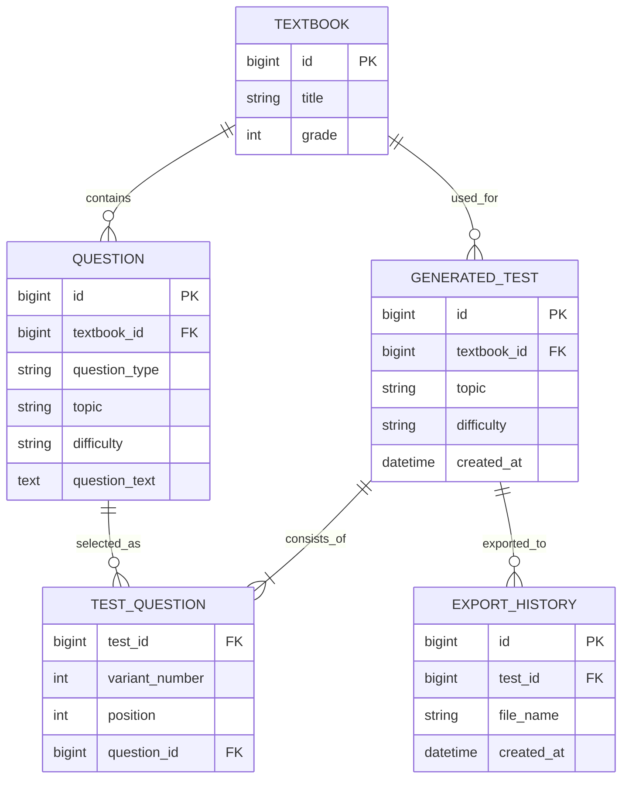
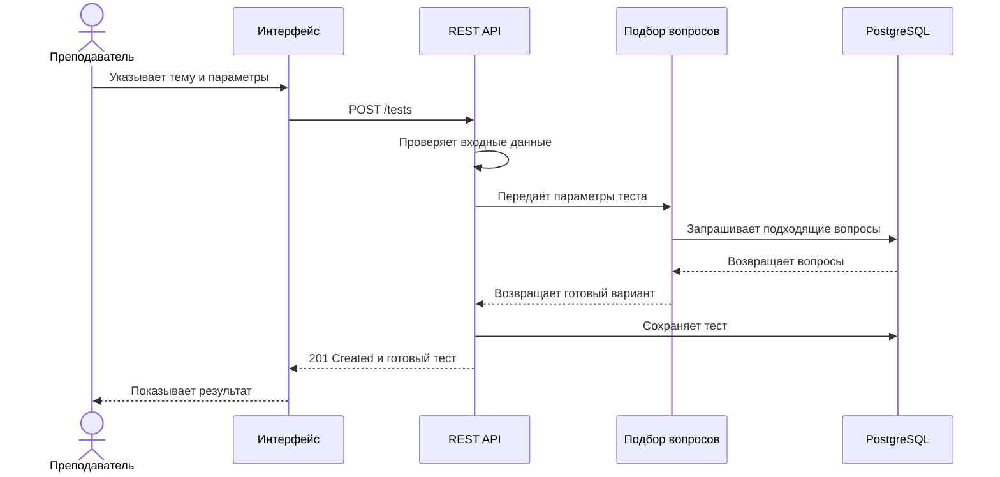
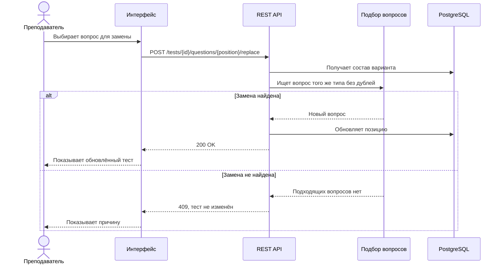

# Системный анализ AI History Helper

Это аналитическая часть моего дипломного проекта
[AI History Helper](https://github.com/us6fu1/AI_History_Helper) — приложения для подготовки тестов по истории.

Само приложение я делал как разработчик. Позже решил рассмотреть его с позиции системного аналитика: описать текущий процесс, требования, ошибки и возможное развитие продукта.

## Как работает приложение

Преподаватель выбирает учебник и тему, задаёт количество и типы вопросов. После этого приложение подбирает задания из подготовленного банка.

Получившийся тест можно проверить, заменить в нём отдельный вопрос и сохранить в DOCX. Приложение работает локально и не требует отправлять учебники во внешний сервис.

## Что я сделал

Сначала я разобрал весь путь преподавателя: от выбора учебника до получения готового документа. На основе этого процесса построил BPMN-схему и описал основные требования к системе.

Отдельно рассмотрел ситуации, когда подходящих вопросов недостаточно, модель недоступна или преподаватель хочет заменить только одно задание. Для основных сценариев добавил Use Case, бизнес-правила и критерии приёмки.

Подробное описание находится в файле
[system-analysis.md](system-analysis.md). Исходную BPMN-схему можно открыть и изменить в
[Camunda Modeler](ai-history-helper-portfolio-as-is.bpmn).

## Техническая часть

После описания текущего процесса я попробовал представить, как могла бы выглядеть серверная версия приложения.

Сейчас программа работает локально с JSON-файлами. Поэтому REST API и PostgreSQL ниже — это предложение по развитию, а не уже реализованная часть приложения.

Более подробное описание находится в
[technical-design.md](technical-design.md).

## ER-модель

В модели учебник связан с банком вопросов и созданными тестами. Таблица `test_question` нужна, чтобы хранить состав каждого варианта и порядок заданий.

## REST API

| Метод | Адрес | Что происходит |
|---|---|---|
| `POST` | `/tests` | создаётся новый тест |
| `GET` | `/tests/{testId}` | возвращается созданный тест |
| `POST` | `/tests/{testId}/questions/{position}/replace` | заменяется один вопрос |
| `POST` | `/tests/{testId}/exports` | вариант сохраняется в DOCX |

Полный черновик API с параметрами запросов, ответами и ошибками находится в
[openapi.yaml](openapi.yaml).

## Создание теста

## Замена вопроса

## Работа с базой данных

Для возможной серверной версии я подготовил
[схему PostgreSQL](schema.sql) и
[примеры SQL-запросов](queries.sql).

В запросах показана выборка вопросов через несколько `JOIN`, подсчёт заданий по типам, поиск заменённых и неиспользованных вопросов, а также получение последнего экспорта через `ROW_NUMBER()`.

## Что здесь настоящее

Само приложение и его исходный код существуют. BPMN и документация сделаны на основе разбора моего дипломного проекта.

REST API и схема PostgreSQL пока не реализованы. Я добавил их как учебный вариант развития продукта, чтобы показать, как связываю требования, процессы, API и структуру данных.

## Что выяснилось во время анализа

Слово «генерация» не совсем точно описывает работу приложения. Модель не создаёт задания полностью с нуля, а помогает выбирать их из подготовленного банка вопросов.

Также пока не определено, что считать одинаковой сложностью для разных типов заданий и как формировать несколько равнозначных вариантов. Эти моменты нужно уточнять с преподавателем перед дальнейшей разработкой.

Серверная версия тоже не является обязательной. Для одного пользователя локального приложения может быть достаточно. Сервер и общая база понадобятся, если с системой будут работать несколько преподавателей или потребуется общая история созданных тестов.
