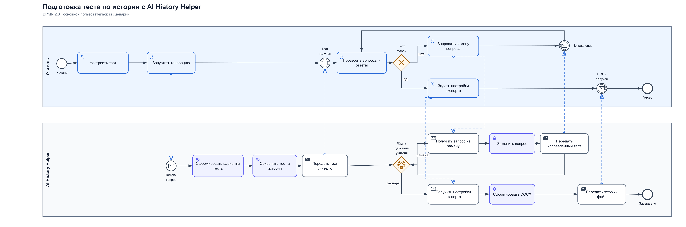
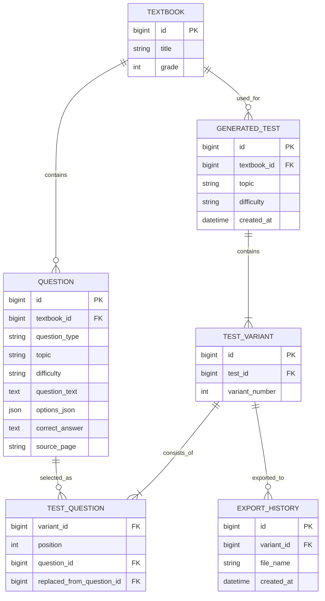
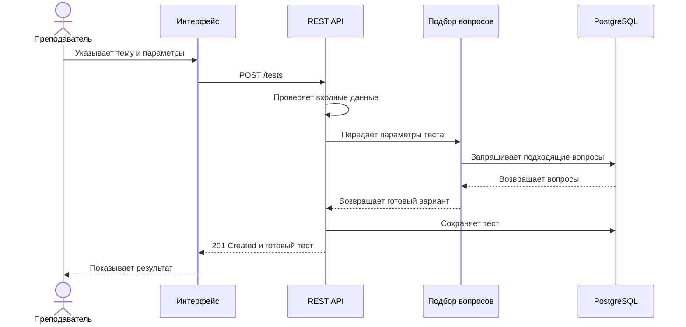
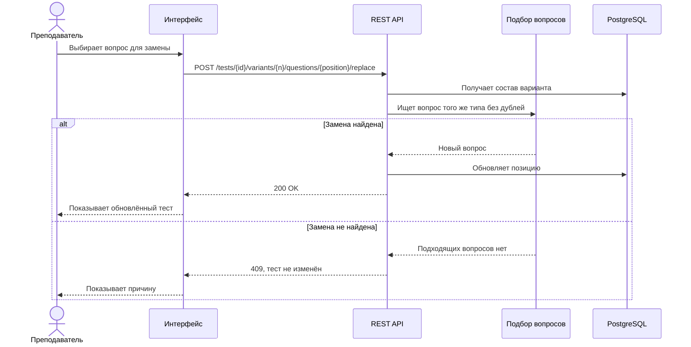

# Системный анализ AI History Helper

Это аналитическая часть моего дипломного проекта
[AI History Helper](https://github.com/us6fu1/AI_History_Helper) — десктопного
приложения для подготовки тестов по истории.

Само приложение я делал как разработчик. Позже решил разобрать его с позиции
системного аналитика: описать пользовательский процесс, требования, ошибки и то,
как можно развивать продукт дальше.

Это схема текущего процесса. Замена вопроса работает только для одного
открытого варианта, а изменённая версия пока не сохраняется обратно в историю.

## Что делает приложение

Преподаватель выбирает учебник и тему, задаёт количество и типы вопросов, после
чего приложение подбирает задания из подготовленного банка. Результат можно
проверить, заменить в нём отдельный вопрос и сохранить в DOCX.

Приложение работает с локальной GGUF-моделью и не требует отправлять учебники во
внешний сервис.

## Что я описал

- основной процесс подготовки теста в BPMN 2.0;
- границы продукта, требования и бизнес-правила;
- основные и ошибочные пользовательские сценарии;
- критерии приёмки;
- влияние изменения «заменить один вопрос, не пересоздавая весь тест».

## Документация

Вся аналитическая часть собрана в одном файле:

**[Открыть системный анализ проекта](system-analysis.md)**

Там находятся описание задачи, границы, требования, бизнес-правила, Use Cases,
критерии приёмки, анализ изменения и открытые вопросы.

Редактируемая диаграмма находится в
[`ai-history-helper-portfolio-as-is.bpmn`](ai-history-helper-portfolio-as-is.bpmn).
Рядом лежат PNG и SVG для просмотра.

## Техническое продолжение

Я отдельно набросал вариант серверной версии. Это **TO-BE**, в текущем
десктопном приложении сервера и PostgreSQL пока нет.

- [`technical-design.md`](technical-design.md) — ER-модель и две Sequence Diagram;
- [`openapi.yaml`](openapi.yaml) — черновик REST API;
- [`schema.sql`](schema.sql) — схема данных для PostgreSQL;
- [`queries.sql`](queries.sql) — примеры запросов к этой схеме.

### ER-модель

### REST API

| Метод | URL | Результат |
|---|---|---|
| `GET` | `/textbooks` | получить список доступных учебников |
| `GET` | `/tests` | получить историю тестов |
| `POST` | `/tests` | создать тест |
| `GET` | `/tests/{testId}` | получить созданный тест |
| `POST` | `/tests/{testId}/variants/{variantNumber}/questions/{position}/replace` | заменить вопрос варианта |
| `POST` | `/tests/{testId}/variants/{variantNumber}/exports` | создать DOCX |
| `GET` | `/exports/{exportId}/file` | скачать готовый файл |

Полный контракт с параметрами и ошибками находится в
[`openapi.yaml`](openapi.yaml).

Генерация в этом варианте API синхронная: успешный `POST /tests` сразу
возвращает готовый тест. При экспорте сначала создаётся ресурс с `downloadUrl`,
а затем DOCX скачивается отдельным запросом.

### Создание теста

### Замена вопроса

### Что есть в SQL

В [`queries.sql`](queries.sql) находятся примеры:

- выбор вопросов варианта через несколько `JOIN`;
- подсчёт вопросов по типам отдельно для каждого варианта;
- поиск заменённых и неиспользованных вопросов;
- получение последнего экспорта через `ROW_NUMBER()`.

## Что в кейсе настоящее, а что учебное

Приложение и его исходный код существуют. BPMN и документ сделаны на основе
разбора текущего поведения моего дипломного проекта. Это учебный кейс, а не
коммерческий опыт.

## Что я заметил во время анализа

- термин «генерация» может создать впечатление, что модель пишет задания с нуля,
  хотя основой служит подготовленный банк вопросов;
- замена вопроса сейчас доступна только для одного варианта;
- изменённый вопрос пока не записывается обратно в историю, поэтому после
  повторного открытия будет показана старая версия;
- понятие одинаковой сложности для разных типов заданий пока не определено;
- сервер и база данных локальному приложению сейчас не обязательны.

## Что хочу сделать дальше

- провести короткое настоящее интервью с преподавателем;
- проверить сценарии на реальном пользователе;
- уточнить правила формирования нескольких вариантов;
- уточнить, нужна ли продукту серверная версия вообще.
