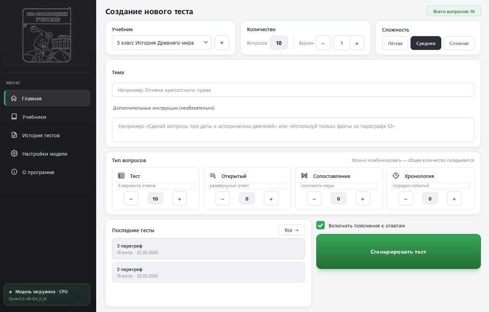
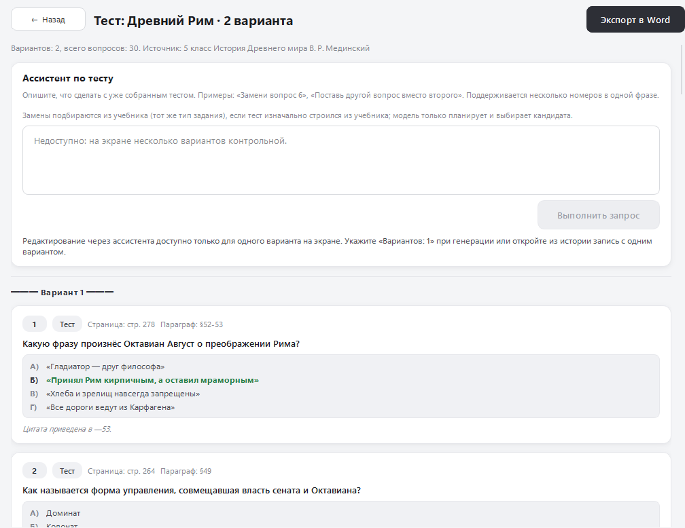
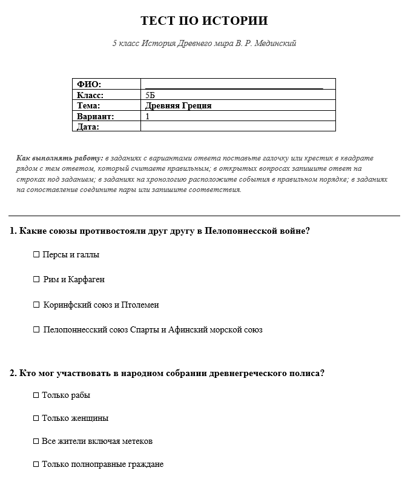
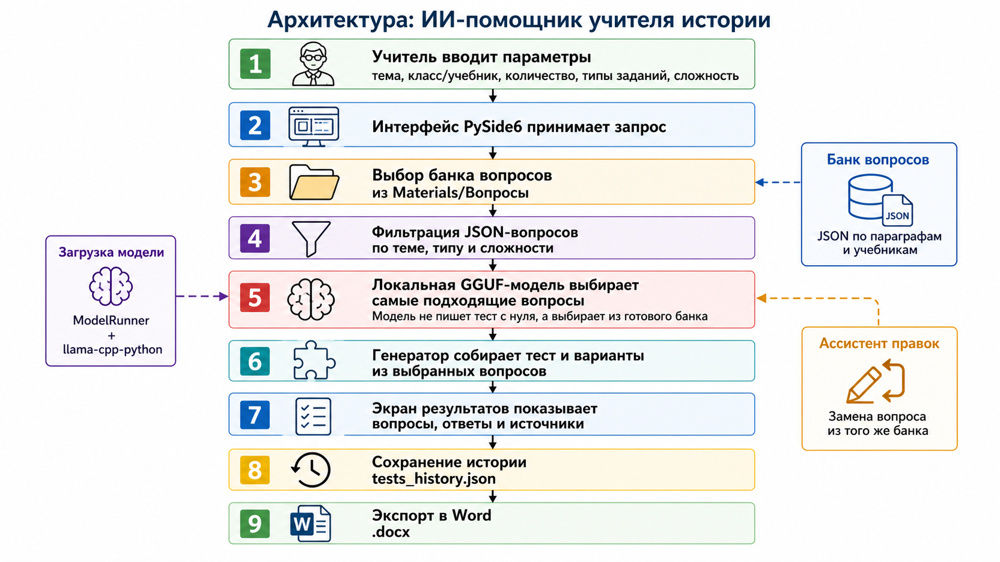

# AI History Helper: кейс системного анализа

Кейс системного анализа на основе работающего дипломного приложения для
подготовки тестов по истории. Приложение разрабатывалось по запросу школы, а
заказчиком выступал учитель истории: он формулировал пожелания, проверял
промежуточные версии и давал обратную связь. Готовое приложение используется
для подготовки школьных тестов.

[Исходный код приложения](https://github.com/us6fu1/AI_History_Helper) написан
на Python/PySide6. Вопросы хранятся в подготовленных JSON-банках, а локальная
GGUF-модель выбирает среди них задания, подходящие под тему и параметры теста.
Модель не создаёт содержание вопросов с нуля, и данные не отправляются во
внешние сервисы.

## Главное в кейсе

Я описал текущий процесс AS-IS, требования, бизнес-правила и пользовательские
сценарии. Во время анализа нашёл разрыв: после точечной замены вопрос меняется
на открытом экране, но обновлённый тест не записывается обратно в историю.

Для этого изменения я связал требования, критерии приёмки, API и модель данных,
а затем предложил TO-BE-вариант серверной версии с REST API и PostgreSQL.

## Работающее приложение

| Настройка теста | Проверка результата |
|---|---|
|  |  |

Пример документа после экспорта:



## Как работает текущая версия



1. Преподаватель выбирает учебник, тему, сложность, число вариантов и типы
   заданий.
2. Приложение загружает подходящий JSON-банк и отбирает кандидатов по заданным
   параметрам.
3. Локальная GGUF-модель ранжирует кандидатов и возвращает идентификаторы
   подходящих вопросов.
4. Приложение проверяет результат модели, исключает дубли и собирает варианты.
5. Преподаватель проверяет тест, при необходимости заменяет отдельный вопрос и
   экспортирует результат в DOCX.

## Артефакты

| Артефакт | Что находится внутри |
|---|---|
| [Аналитическая документация](system-analysis.md) | контекст, границы, требования, бизнес-правила, Use Case, критерии приёмки и трассировка |
| [BPMN AS-IS](ai-history-helper-portfolio-as-is.png) | текущий процесс подготовки и проверки теста |
| [Редактируемая BPMN](ai-history-helper-portfolio-as-is.bpmn) | исходник диаграммы BPMN 2.0 |
| [Техническое предложение](technical-design.md) | TO-BE-компоненты, ER-модель и три Sequence Diagram |
| [OpenAPI](openapi.yaml) | контракт REST API с примерами запросов, ответов и ошибок |
| [Схема PostgreSQL](schema.sql) | таблицы, ограничения, связи и индексы |
| [Тестовые данные](sample-data.sql) | небольшой набор данных для проверки схемы и запросов |
| [SQL-запросы](queries.sql) | JOIN, GROUP BY, HAVING, NOT EXISTS и оконная функция |

## BPMN AS-IS


Диаграмма показывает существующее поведение. Замена доступна только при работе
с одним открытым вариантом, а изменённая версия пока не сохраняется обратно в
историю.

## TO-BE в двух словах

В предлагаемой версии интерфейс обращается к API `/api/v1`. PostgreSQL хранит
банки вопросов, созданные варианты и историю экспортов. Отдельный модуль
подбора получает кандидатов из базы, передаёт их локальной модели и проверяет
возвращённые идентификаторы. Подробности и обоснование решений находятся в
[техническом предложении](technical-design.md).

Основные решения:

- генерация описана синхронно: успешный `POST /tests` возвращает готовый тест;
- для истории используется `limit/offset`, так как ожидается небольшой объём и
  стабильная сортировка по дате и идентификатору;
- несовместимые изменения API оформляются новой версией в URL;
- ошибки возвращаются единообразно: HTTP-статус, код, сообщение, детали и
  `traceId`;
- модель выбирает только из переданного набора кандидатов, а результат
  дополнительно проверяется приложением.

## Как проверить SQL

Файлы рассчитаны на пустую базу PostgreSQL:

```bash
createdb ai_history_helper
psql -d ai_history_helper -f schema.sql
psql -d ai_history_helper -f sample-data.sql
psql -d ai_history_helper -f queries.sql
```

## Что настоящее, а что спроектировано

Работающее десктопное приложение, JSON-банки, локальная модель, история и
экспорт в DOCX существуют. AS-IS основан на фактическом поведении продукта и
обратной связи заказчика.

REST API, PostgreSQL и серверное разделение компонентов относятся к TO-BE. Они
спроектированы как развитие продукта, но не выдаются за реализованную часть или
коммерческий опыт.

## Открытые вопросы

- нужна ли серверная версия одному преподавателю или она имеет смысл только при
  работе нескольких пользователей;
- потребуется ли хранить полную историю повторных замен одного вопроса;
- допустимы ли одинаковые вопросы в разных вариантах;
- как формально сравнивать сложность разных типов заданий;
- какой предел времени ответа выбрать после измерений на целевом оборудовании.
