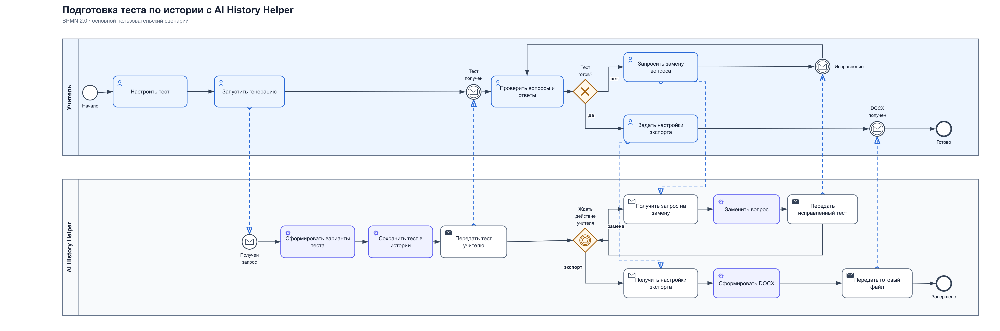

# Аналитическая документация AI History Helper

## 1. Контекст

AI History Helper — мой дипломный проект: локальное десктопное приложение,
которое помогает преподавателю собирать тесты по истории. Приложение
разрабатывалось по запросу школы. Заказчиком выступал учитель истории: он
объяснял текущий процесс, проверял промежуточные версии и давал обратную связь.

Вопросы берутся из подготовленного JSON-банка. Локальная GGUF-модель не пишет
задания с нуля, а выбирает из переданного списка вопросы, подходящие по теме и
параметрам теста. Итоговый результат обязательно проверяет преподаватель.

Этот документ — системный анализ уже существующего продукта и предложение по
его развитию. Это учебный кейс на основе реальной работы с заказчиком, а не
коммерческий проект или описание работы в компании.

### 1.1. Как собирались требования

- интервью и обсуждение текущего процесса с учителем;
- просмотр примеров тестов и готовых документов;
- демонстрация промежуточных версий приложения;
- фиксация замечаний и повторное согласование после доработки;
- анализ фактического поведения уже работающего продукта.

## 2. Проблема и цель

При ручной подготовке теста преподавателю приходится искать подходящие вопросы,
проверять их, собирать варианты и оформлять документ. Если один вопрос не
подходит, не хочется пересобирать весь удачный вариант.

Цель продукта — сократить повторяющиеся действия, но оставить окончательную
проверку содержания преподавателю.

## 3. Пользователи и границы

Основной пользователь — преподаватель истории. Ученик получает готовый тест,
но напрямую с приложением не работает.

В текущие границы входят:

- выбор учебника, темы, сложности и типов заданий;
- формирование одного или нескольких вариантов;
- просмотр результата и источников вопросов;
- замена неподходящего вопроса;
- локальная история;
- экспорт выбранного варианта в DOCX.

Не входят: проведение тестирования учеников, электронный журнал, роли,
авторизация и синхронизация между компьютерами.

## 4. Основной процесс

Полная схема находится в
[`ai-history-helper-portfolio-as-is.bpmn`](ai-history-helper-portfolio-as-is.bpmn),
а PNG-версия показана ниже.



На диаграмме показан процесс **AS-IS**. Ветка замены вопроса доступна только
тогда, когда на экране открыт один вариант. После замены приложение обновляет
показанный тест, но не записывает изменённую версию обратно в историю. Поэтому
отдельного шага сохранения после замены на этой схеме нет.

Краткий сценарий:

1. Преподаватель выбирает учебник и вводит тему.
2. Указывает сложность, количество вариантов и состав заданий.
3. Система проверяет обязательные параметры.
4. Система подбирает вопросы и формирует тест.
5. Преподаватель проверяет результат.
6. Если вопрос не подходит, преподаватель запрашивает его замену.
7. Готовый вариант сохраняется в DOCX.

## 5. Требования

| ID | Требование | Приоритет | Статус |
|---|---|---|---|
| FR-01 | Пользователь выбирает подключённый банк вопросов | Must | Есть в продукте |
| FR-02 | До запуска требуется указать тему и хотя бы один тип задания | Must | Есть в продукте |
| FR-03 | Пользователь выбирает сложность и количество вариантов | Should | Есть в продукте |
| FR-04 | Поддерживаются тестовые, открытые, хронологические задания и сопоставление | Must | Есть в продукте |
| FR-05 | Генерация запускается только при загруженной локальной модели | Must | Есть в продукте |
| FR-06 | Во время обработки повторный запуск блокируется | Must | Есть в продукте |
| FR-07 | После генерации показываются вопросы, ответы и доступный источник | Must | Есть в продукте |
| FR-08 | Сформированный тест сохраняется в локальной истории | Should | Есть в продукте |
| FR-09 | Пользователь может заменить конкретный вопрос в одном варианте | Must | Есть, только для одного открытого варианта |
| FR-10 | Замена не должна менять остальные вопросы и их порядок | Must | Есть на текущем экране |
| FR-11 | Новый вопрос не должен дублировать вопросы текущего теста | Must | Есть в продукте |
| FR-12 | Выбранный вариант можно экспортировать в DOCX | Must | Есть в продукте |
| FR-13 | После замены обновлённый вариант сохраняется в истории | Should | Пока не реализовано |

Нефункциональные требования сформулированы через результат, который можно
проверить без случайных ограничений по времени ответа.

| ID | Требование и способ проверки | Статус |
|---|---|---|
| NFR-01 | При локальной работе текст учебника и вопросы не отправляются во внешний сервис. Проверяется запуском без подключения к интернету | Есть в продукте |
| NFR-02 | Если замена завершилась ошибкой, текст исходного вопроса и остальные позиции остаются без изменений | Есть в продукте |
| NFR-03 | Аварийное завершение во время сохранения не должно делать ранее сохранённую историю нечитаемой. Проверяется повторным запуском и чтением JSON | Требует доработки и проверки |
| NFR-04 | При ошибке пользователь видит конкретную причину: не загружена модель, не заполнена тема, нет подходящего вопроса или указан неверный номер | Частично проверено |
| NFR-05 | Кириллица сохраняется в JSON и экспортированном документе без замены символов | Есть в продукте |
| NFR-06 | Экспортированный файл открывается в Microsoft Word и LibreOffice, содержит вопросы в выбранном порядке | Требует проверки в двух программах |

## 6. Бизнес-правила

| ID | Правило |
|---|---|
| BR-01 | Тест нельзя сформировать без темы, банка, модели и выбранных заданий |
| BR-02 | Общее число вопросов равно сумме количеств по типам |
| BR-03 | В одном варианте не должно быть одинаковых вопросов |
| BR-04 | Замена не меняет общее число вопросов |
| BR-05 | Если подходящая замена не найдена, исходный вопрос остаётся |
| BR-06 | Перед использованием тест проверяет преподаватель |

## 7. Use cases

### UC-01. Сформировать тест

**Цель:** получить один или несколько вариантов теста по заданной теме.

**Основной актор:** преподаватель.

**Триггер:** преподаватель нажимает кнопку создания теста.

**Предусловия:** подключён банк вопросов, локальная модель загружена.

**Постусловия:** сформированный тест показан пользователю и записан в историю.

**Основной сценарий:**

1. Преподаватель выбирает учебник и вводит тему.
2. Преподаватель задаёт сложность, количество вариантов и число заданий каждого
   типа.
3. Система проверяет обязательные параметры.
4. Система отбирает из банка подходящих кандидатов.
5. Модель ранжирует кандидатов и возвращает их идентификаторы.
6. Система проверяет, что идентификаторы существуют, вопросов достаточно и
   среди них нет дублей.
7. Система собирает варианты, сохраняет их в истории и показывает результат.
8. Преподаватель проверяет содержание теста.

**Альтернативы и ошибки:**

- 3а. Не заполнена тема или не выбран тип задания — система не начинает
  обработку и показывает, что нужно исправить.
- 3б. Модель или банк недоступны — система сообщает причину, тест не создаётся.
- 6а. Подходящих вопросов недостаточно — система сообщает, для какого типа не
  хватило заданий, и не сохраняет неполный тест.
- 7а. Историю сохранить не удалось — система сообщает об ошибке и не выдаёт
  несохранённый результат за успешно созданный тест.

### UC-02. Заменить вопрос

**Цель:** заменить один неподходящий вопрос, не пересоздавая остальной тест.

**Основной актор:** преподаватель.

**Триггер:** преподаватель выбирает позицию вопроса и подтверждает замену.

**Предусловия:** открыт тест с одним вариантом, исходный банк и модель доступны.

**Постусловия:** изменена только выбранная позиция, количество и порядок
остальных вопросов сохранены.

**Основной сценарий:**

1. Система проверяет номер позиции.
2. Система определяет тип, тему и сложность исходного вопроса.
3. Из банка исключаются исходный вопрос и вопросы, уже использованные в
   варианте.
4. Модель выбирает нового кандидата из оставшегося списка.
5. Система проверяет идентификатор кандидата и отсутствие дубля.
6. Новый вопрос подставляется в выбранную позицию открытого теста.
7. Пользователь видит обновлённый вариант.

**Альтернативы и ошибки:**

- 1а. Позиция отсутствует или выходит за диапазон — система показывает ошибку.
- 3а. Подходящих кандидатов нет — исходный вопрос остаётся без изменений.
- 4а. Модель недоступна или вернула некорректный идентификатор — замена не
  применяется.
- 6а. При внутренней ошибке замена не применяется, пользователь видит исходный
  вариант.

**Ограничение текущей версии:** заменённый вопрос меняется только на открытом
экране. Если снова открыть тест из истории, будет показана версия до замены.

### UC-03. Экспортировать DOCX

**Цель:** получить готовый документ для печати.

**Основной актор:** преподаватель.

**Предусловия:** тест сформирован, выбран один вариант.

**Основной сценарий:**

1. Преподаватель указывает класс и состав документа.
2. Выбирает, добавлять ли ответы, пояснения и отдельный лист ответов.
3. Подтверждает экспорт.
4. Система формирует DOCX из актуального состояния варианта.
5. Пользователь выбирает папку и сохраняет файл.

**Альтернативы и ошибки:** отмена выбора папки не меняет тест; при ошибке записи
система сообщает причину и позволяет повторить экспорт.

## 8. Разбор изменения: заменить один вопрос

Проблема: девять вопросов могут подходить, а один — нет. Полная повторная
генерация уничтожает удачный набор и заставляет проверять его заново.

При добавлении точечной замены затрагиваются:

| Область | Что нужно учесть |
|---|---|
| Интерфейс | Номер вопроса, состояние обработки, понятный результат |
| Проверка команды | Номер существует и находится в допустимом диапазоне |
| Подбор вопроса | Тот же тип, подходящая тема и сложность |
| Дубликаты | Новый вопрос отсутствует в текущем варианте |
| История | Нужно определить, хранить ли исходную версию |
| Экспорт | В DOCX должно попадать актуальное состояние теста |

Безопасное поведение: сначала найти и проверить замену, затем применить её. Если
это невозможно, ничего не менять и показать причину.

## 9. Критерии приёмки

### AC-01. Успешная генерация

```gherkin
Given модель загружена и банк вопросов подключён
And пользователь заполнил тему и состав теста
When пользователь запускает генерацию
Then система формирует заданное количество вопросов
And сохраняет тест в истории
And показывает результат для проверки
```

### AC-02. Не введена тема

```gherkin
Given тема не заполнена
When пользователь запускает генерацию
Then генерация не начинается
And система просит ввести тему
```

### AC-03. Замена вопроса

```gherkin
Given открыт тест из 10 вопросов с одним вариантом
When пользователь просит заменить вопрос 6
Then изменяется только вопрос 6
And количество вопросов остаётся равным 10
And новый вопрос не дублирует остальные
```

### AC-04. Замена не найдена

```gherkin
Given подходящего вопроса в банке нет
When пользователь запрашивает замену
Then исходный тест не изменяется
And система объясняет причину
```

### AC-05. Экспорт

```gherkin
Given тест сформирован и выбран вариант
When пользователь подтверждает экспорт
Then система создаёт открываемый DOCX в выбранной папке
```

### AC-06. Сохранение замены в будущей версии

```gherkin
Given открыт сохранённый тест с одним вариантом
And вопрос был успешно заменён
When пользователь повторно открывает этот тест из истории
Then система показывает новый вопрос на той же позиции
And остальные вопросы не изменены
```

Сейчас AC-06 не выполняется. Он фиксирует известный разрыв между текущим
поведением и ожидаемым результатом, а не выдаётся за готовую функцию.

## 10. Матрица трассируемости ключевых требований

| Требование | Сценарий или проверка | TO-BE API | Данные |
|---|---|---|---|
| FR-01 | UC-01 | `GET /textbooks` | `textbook` |
| FR-03 | UC-01, AC-01 | `POST /tests` | `generated_test`, `test_variant` |
| FR-07 | UC-01, AC-01 | `GET /tests/{testId}` | `test_question`, `question` |
| FR-08 | UC-01, AC-01 | `GET /tests` | `generated_test` |
| FR-09, FR-10 | UC-02, AC-03 | `POST /tests/{testId}/variants/{variantNumber}/questions/{position}/replace` | `test_question.replaced_from_question_id` |
| FR-11, NFR-02 | UC-02, AC-04 | тот же метод, ответ `409` без изменения | `UNIQUE (variant_id, question_id)` |
| FR-12 | UC-03, AC-05 | `POST .../exports`, затем `GET /exports/{exportId}/file` | `export_history` |
| FR-13 | AC-06 | сохранение успешной замены в TO-BE | `test_question.question_id` |
| NFR-05, NFR-06 | UC-03, AC-05 | получение бинарного DOCX | проверка готового файла |

Матрица показывает требования, напрямую связанные с основными сценариями и
предлагаемым изменением. API и PostgreSQL здесь относятся к предлагаемой
серверной версии TO-BE, а не к уже работающему десктопному приложению.

## 11. Риски и открытые вопросы

- модель может подобрать формально подходящий, но некорректный вопрос;
- пока не определено, что считать одинаковой сложностью для разных типов задач;
- нужно решить, допустимы ли одинаковые вопросы в разных вариантах;
- изменённый после замены тест сейчас не сохраняется обратно в историю;
- этап проверки преподавателем нельзя убирать из процесса.

## 12. Техническое предложение

В рамках аналитического кейса я описал возможную серверную версию продукта.
Текущая версия остаётся локальной, поэтому это не реализованная архитектура, а
вариант развития.

- [модель данных и Sequence Diagram](technical-design.md);
- [контракт REST API](openapi.yaml);
- [схема PostgreSQL](schema.sql);
- [тестовые данные](sample-data.sql);
- [примеры SQL-запросов](queries.sql).
