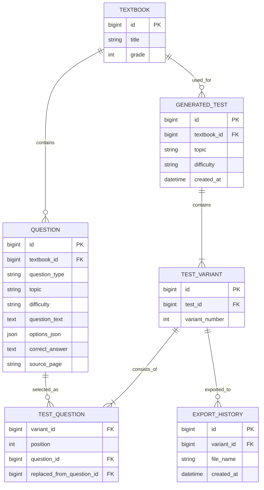
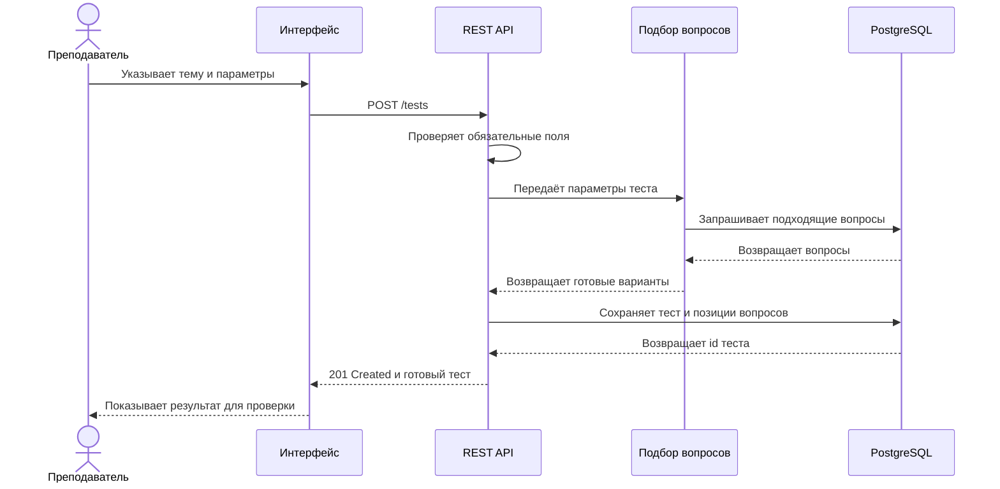
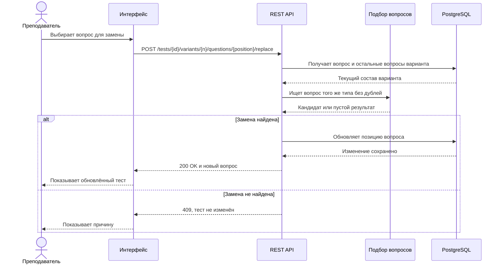
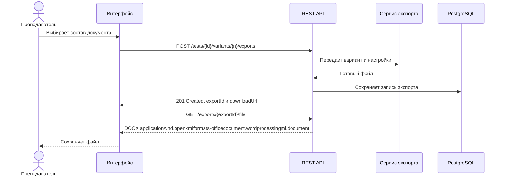

# Техническое предложение

## Статус

Сейчас приложение работает локально и хранит данные в JSON. Ниже я описал
простой вариант серверной версии с REST API и PostgreSQL. Это TO-BE-модель, она
пока не реализована в коде.

## Модель данных

Я оставил только те сущности, которые нужны для основного сценария. Пользователей
и роли не добавлял, потому что в текущей версии с приложением работает один
преподаватель. Вариант теста вынесен в отдельную сущность: так вопросы и экспорт
нельзя случайно связать с несуществующим номером варианта.

Связующая таблица `test_question` хранит выбранный вопрос и его позицию внутри
конкретного варианта. Поле `replaced_from_question_id` заполняется после замены
и помогает понять, какой вопрос был до неё.

Генерация в этой версии предложения синхронная: `POST /tests` либо возвращает
готовый тест, либо ошибку. Поэтому поле `status` не используется. Состояния
`processing`, `ready` и `failed` понадобились бы только при переходе на
асинхронную обработку с ответом `202 Accepted`.

## Основные методы API

| Метод | URL | Для чего нужен |
|---|---|---|
| `GET` | `/textbooks` | получить доступные учебники и их идентификаторы |
| `GET` | `/tests` | получить историю с фильтрами и пагинацией |
| `POST` | `/tests` | создать тест по заданным параметрам |
| `GET` | `/tests/{testId}` | получить ранее созданный тест |
| `POST` | `/tests/{testId}/variants/{variantNumber}/questions/{position}/replace` | заменить один вопрос варианта |
| `POST` | `/tests/{testId}/variants/{variantNumber}/exports` | создать DOCX и запись экспорта |
| `GET` | `/exports/{exportId}/file` | скачать созданный DOCX |

Для замены я оставил отдельный `POST`, потому что это действие со своими
проверками, а не обычное редактирование полей вопроса. Номер варианта находится
в URL, поэтому сервер однозначно понимает, где делать замену. В текущем
десктопном приложении эта функция доступна только при открытом тесте с одним
вариантом; возможность указать вариант — часть TO-BE-контракта.

При экспорте сервер сначала создаёт ресурс экспорта и возвращает `exportId` и
`downloadUrl`. Сам файл клиент получает отдельным `GET`. Путь к локальной папке
в API не передаётся: для серверной версии он не имеет смысла.

## Создание теста

Если тема пустая или для всех типов заданий указано количество `0`, API
возвращает ошибку `400` и не создаёт тест. Если вопросов не хватило,
возвращается `409`.

## Замена одного вопроса

Замену лучше применять только после того, как новый вопрос найден и проверен.
Так исходный вариант не будет испорчен при ошибке.

## Экспорт и получение файла

В запрос экспорта входят класс, ответы, пояснения и отдельный лист ответов. Это
соответствует настройкам текущего интерфейса, кроме выбора локальной папки.

## Связанные файлы

- [OpenAPI](openapi.yaml)
- [схема данных](schema.sql)
- [SQL-запросы](queries.sql)
