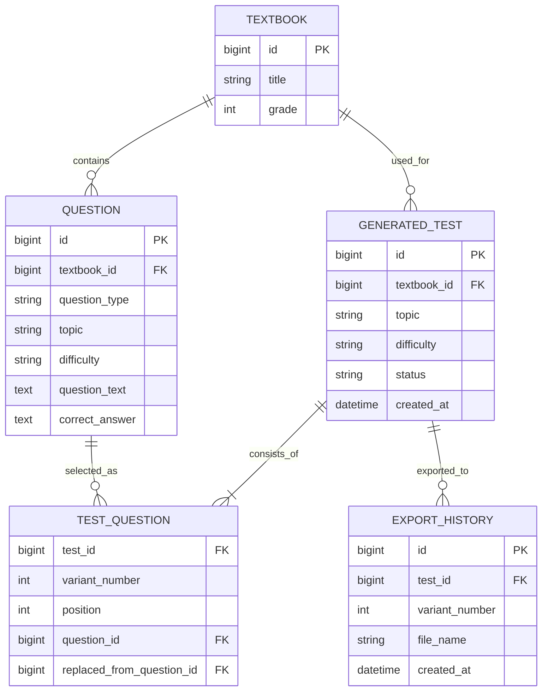
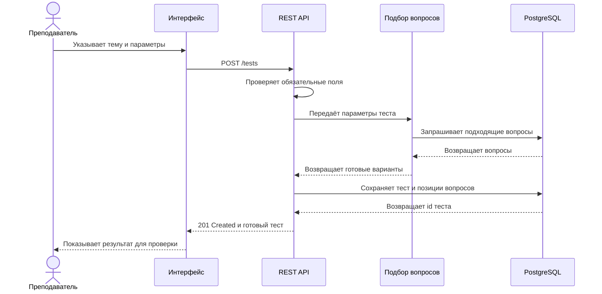
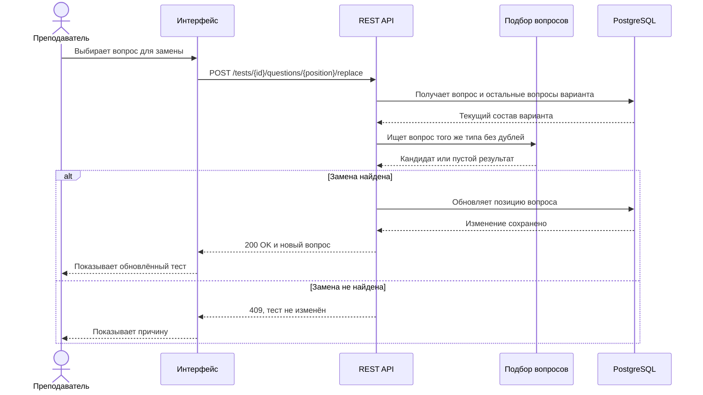

# Техническое предложение

## Статус

Сейчас приложение работает локально и хранит данные в JSON. Ниже я описал
простой вариант серверной версии с REST API и PostgreSQL. Это TO-BE-модель, она
пока не реализована в коде.

## Модель данных

Я оставил только те сущности, которые нужны для основного сценария. Пользователей
и роли не добавлял, потому что в текущей версии с приложением работает один
преподаватель.

Связующая таблица `test_question` хранит не только выбранный вопрос, но и его
позицию в варианте. Поле `replaced_from_question_id` заполняется после замены и
помогает понять, какой вопрос был до неё.

## Основные методы API

| Метод | URL | Для чего нужен |
|---|---|---|
| `POST` | `/tests` | создать тест по заданным параметрам |
| `GET` | `/tests/{testId}` | получить ранее созданный тест |
| `POST` | `/tests/{testId}/questions/{position}/replace` | заменить один вопрос |
| `POST` | `/tests/{testId}/exports` | сохранить вариант в DOCX |

Для замены я оставил отдельный `POST`, потому что это отдельное действие со
своими проверками, а не обычное редактирование всех полей вопроса. Полное
описание запросов и ответов находится в `openapi.yaml`.

## Создание теста

Если тема пустая или для всех типов заданий указано количество `0`, API
возвращает ошибку `400` и не создаёт тест. Если вопросов не хватило,
возвращается `409`.

## Замена одного вопроса

Замену лучше применять только после того, как новый вопрос найден и проверен.
Так исходный вариант не будет испорчен при ошибке.

## Связанные файлы

- [OpenAPI](openapi.yaml)
- [схема данных](schema.sql)
- [SQL-запросы](queries.sql)
