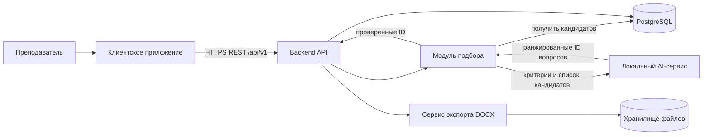
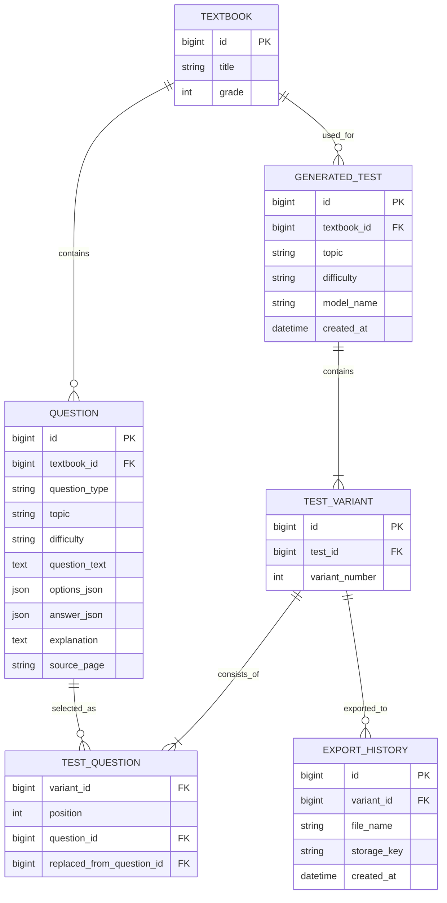
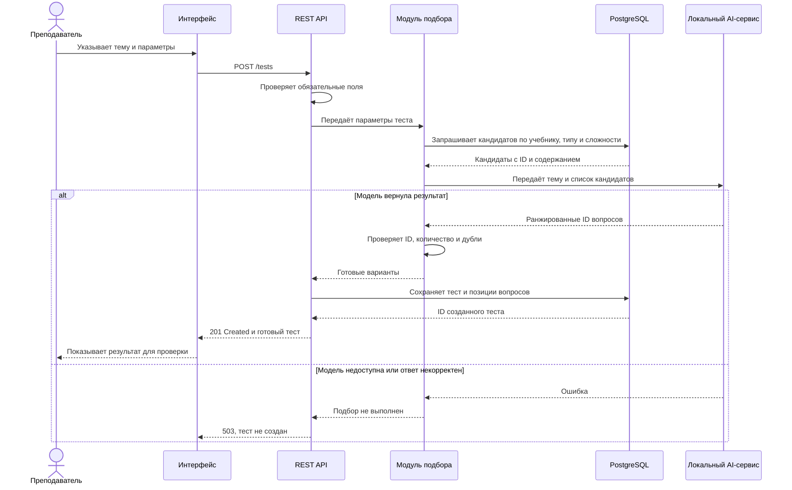
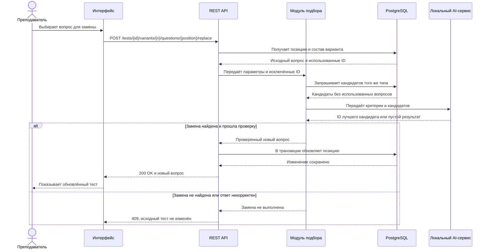
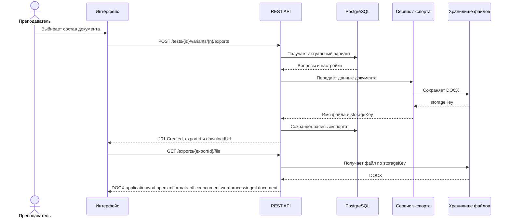

# Техническое предложение

## Статус и границы

Текущее приложение работает локально и хранит банки вопросов и историю в JSON.
Ниже описан TO-BE-вариант с REST API и PostgreSQL. Он не реализован в коде и
нужен как проработка возможного развития продукта.

Для первой версии предполагается один преподаватель и развёртывание в
контролируемом контуре школы. Поэтому авторизация не входит в текущий объём. При
переходе к нескольким преподавателям потребуется добавить пользователей,
принадлежность тестов и разграничение доступа.

## Компоненты TO-BE

```mermaid
flowchart LR
    Teacher[Преподаватель] --> UI[Клиентское приложение]
    UI -->|HTTPS REST /api/v1| API[Backend API]
    API --> Selection[Модуль подбора]
    Selection -->|получить кандидатов| DB[(PostgreSQL)]
    Selection -->|критерии и список кандидатов| AI[Локальный AI-сервис]
    AI -->|ранжированные ID вопросов| Selection
    Selection -->|проверенные ID| API
    API --> DB
    API --> Export[Сервис экспорта DOCX]
    Export --> Files[(Хранилище файлов)]
```

Модель получает только кандидатов, уже отфильтрованных по учебнику, типу и
сложности. Она возвращает идентификаторы вопросов, а не новый текст. Модуль
подбора проверяет, что каждый идентификатор был среди кандидатов, вопросов
достаточно и в одном варианте нет дублей. Если модель недоступна или её ответ не
проходит проверку, тест не сохраняется и API возвращает ошибку.

## Модель данных

Для разных типов заданий ответ имеет разную структуру: строку, несколько
допустимых ответов, пары для сопоставления или порядок элементов. Поэтому в
TO-BE ответ хранится в `answer_json`, а не в одном текстовом поле.

```mermaid
erDiagram
    TEXTBOOK ||--o{ QUESTION : contains
    TEXTBOOK ||--o{ GENERATED_TEST : used_for
    GENERATED_TEST ||--|{ TEST_VARIANT : contains
    TEST_VARIANT ||--|{ TEST_QUESTION : consists_of
    QUESTION ||--o{ TEST_QUESTION : selected_as
    TEST_VARIANT ||--o{ EXPORT_HISTORY : exported_to

    TEXTBOOK {
        bigint id PK
        string title
        int grade
    }
    QUESTION {
        bigint id PK
        bigint textbook_id FK
        string question_type
        string topic
        string difficulty
        text question_text
        json options_json
        json answer_json
        text explanation
        string source_page
    }
    GENERATED_TEST {
        bigint id PK
        bigint textbook_id FK
        string topic
        string difficulty
        string model_name
        datetime created_at
    }
    TEST_VARIANT {
        bigint id PK
        bigint test_id FK
        int variant_number
    }
    TEST_QUESTION {
        bigint variant_id FK
        int position
        bigint question_id FK
        bigint replaced_from_question_id FK
    }
    EXPORT_HISTORY {
        bigint id PK
        bigint variant_id FK
        string file_name
        string storage_key
        datetime created_at
    }
```

`test_question` хранит текущее состояние позиции внутри варианта. Поле
`replaced_from_question_id` позволяет увидеть предыдущий вопрос после одной
замены. Если потребуется аудит нескольких последовательных замен, для них нужна
отдельная таблица истории. Пока это оставлено открытым вопросом.

`model_name` фиксирует модель, использованную при подборе. `storage_key`
указывает, где лежит созданный DOCX; одного отображаемого имени файла для
скачивания недостаточно.

## Решения по API

Базовый адрес: `/api/v1`. Новая версия в URL потребуется только при
несовместимом изменении контракта. Добавление необязательного поля или нового
метода не требует перехода на `/v2`.

| Метод | URL | Для чего нужен |
|---|---|---|
| `GET` | `/textbooks` | получить доступные учебники |
| `GET` | `/tests` | получить историю с фильтрами и пагинацией |
| `POST` | `/tests` | создать тест по заданным параметрам |
| `GET` | `/tests/{testId}` | получить ранее созданный тест |
| `POST` | `/tests/{testId}/variants/{variantNumber}/questions/{position}/replace` | заменить один вопрос варианта |
| `POST` | `/tests/{testId}/variants/{variantNumber}/exports` | создать DOCX и запись экспорта |
| `GET` | `/exports/{exportId}/file` | скачать созданный DOCX |

Для истории выбрана пагинация `limit/offset`: ожидается небольшой объём данных,
а пользователю важна возможность перейти к конкретной странице. Результат
сортируется по `created_at DESC, id DESC`, чтобы порядок был стабильным. При
большом и постоянно изменяющемся списке лучше перейти на курсор.

Замена оформлена отдельным `POST`, потому что это доменное действие с поиском и
проверками, а не обычное изменение полей вопроса. В текущем приложении замена
доступна только для одного открытого варианта; возможность указать вариант в
URL относится к TO-BE.

Ошибки имеют единый JSON-формат: `code`, `message`, `details` и `traceId`.
Используются:

- `400` — неверный формат или отсутствуют обязательные данные;
- `404` — тест, вариант, позиция или экспорт не найдены;
- `409` — операция конфликтует с текущим состоянием, например подходящей замены
  нет и исходный вопрос должен остаться;
- `500` — непредвиденная внутренняя ошибка;
- `503` — модуль подбора, модель или экспорт временно недоступны.

## Создание теста

```mermaid
sequenceDiagram
    actor Teacher as Преподаватель
    participant UI as Интерфейс
    participant API as REST API
    participant Selection as Модуль подбора
    participant DB as PostgreSQL
    participant AI as Локальный AI-сервис

    Teacher->>UI: Указывает тему и параметры
    UI->>API: POST /tests
    API->>API: Проверяет обязательные поля
    API->>Selection: Передаёт параметры теста
    Selection->>DB: Запрашивает кандидатов по учебнику, типу и сложности
    DB-->>Selection: Кандидаты с ID и содержанием
    Selection->>AI: Передаёт тему и список кандидатов
    alt Модель вернула результат
        AI-->>Selection: Ранжированные ID вопросов
        Selection->>Selection: Проверяет ID, количество и дубли
        Selection-->>API: Готовые варианты
        API->>DB: Сохраняет тест и позиции вопросов
        DB-->>API: ID созданного теста
        API-->>UI: 201 Created и готовый тест
        UI-->>Teacher: Показывает результат для проверки
    else Модель недоступна или ответ некорректен
        AI-->>Selection: Ошибка
        Selection-->>API: Подбор не выполнен
        API-->>UI: 503, тест не создан
    end
```

Генерация описана синхронно: `POST /tests` возвращает готовый тест или ошибку.
Если измерения покажут, что подбор часто длится дольше допустимого времени,
контракт следует изменить на асинхронный: `202 Accepted`, ресурс операции и
состояния `processing`, `ready`, `failed`.

Пустая тема или нулевое количество всех типов заданий дают `400`. Если после
фильтрации не хватает вопросов, возвращается `409`; неполный тест не создаётся.

## Замена одного вопроса

```mermaid
sequenceDiagram
    actor Teacher as Преподаватель
    participant UI as Интерфейс
    participant API as REST API
    participant Selection as Модуль подбора
    participant DB as PostgreSQL
    participant AI as Локальный AI-сервис

    Teacher->>UI: Выбирает вопрос для замены
    UI->>API: POST /tests/{id}/variants/{n}/questions/{position}/replace
    API->>DB: Получает позицию и состав варианта
    DB-->>API: Исходный вопрос и использованные ID
    API->>Selection: Передаёт параметры и исключённые ID
    Selection->>DB: Запрашивает кандидатов того же типа
    DB-->>Selection: Кандидаты без использованных вопросов
    Selection->>AI: Передаёт критерии и кандидатов
    AI-->>Selection: ID лучшего кандидата или пустой результат
    alt Замена найдена и прошла проверку
        Selection-->>API: Проверенный новый вопрос
        API->>DB: В транзакции обновляет позицию
        DB-->>API: Изменение сохранено
        API-->>UI: 200 OK и новый вопрос
        UI-->>Teacher: Показывает обновлённый тест
    else Замена не найдена или ответ некорректен
        Selection-->>API: Замена не выполнена
        API-->>UI: 409, исходный тест не изменён
    end
```

Сначала находится и проверяется новый вопрос, и только после этого выполняется
изменение. Обновление позиции происходит в транзакции, поэтому при ошибке
исходный вариант остаётся целым.

## Экспорт и получение файла

```mermaid
sequenceDiagram
    actor Teacher as Преподаватель
    participant UI as Интерфейс
    participant API as REST API
    participant DB as PostgreSQL
    participant DOCX as Сервис экспорта
    participant Files as Хранилище файлов

    Teacher->>UI: Выбирает состав документа
    UI->>API: POST /tests/{id}/variants/{n}/exports
    API->>DB: Получает актуальный вариант
    DB-->>API: Вопросы и настройки
    API->>DOCX: Передаёт данные документа
    DOCX->>Files: Сохраняет DOCX
    Files-->>DOCX: storageKey
    DOCX-->>API: Имя файла и storageKey
    API->>DB: Сохраняет запись экспорта
    API-->>UI: 201 Created, exportId и downloadUrl
    UI->>API: GET /exports/{exportId}/file
    API->>Files: Получает файл по storageKey
    Files-->>API: DOCX
    API-->>UI: DOCX application/vnd.openxmlformats-officedocument.wordprocessingml.document
```

В запрос экспорта входят класс, ответы, пояснения и отдельный лист ответов. Путь
к локальной папке клиента в API не передаётся: сервер возвращает файл, а место
сохранения выбирает пользователь.

## Открытые технические вопросы

- граница времени, после которой генерацию нужно переводить в асинхронный режим;
- способ хранения файлов: локальный диск сервера или объектное хранилище;
- необходимость полной истории повторных замен;
- авторизация и разделение данных при появлении нескольких преподавателей;
- правила повторной обработки одинаковых POST-запросов.

## Связанные файлы

- [OpenAPI](openapi.yaml)
- [схема данных](schema.sql)
- [тестовые данные](sample-data.sql)
- [SQL-запросы](queries.sql)
